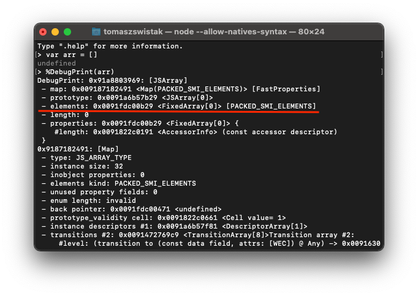
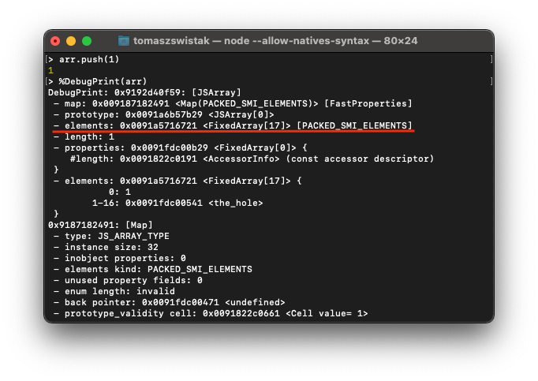
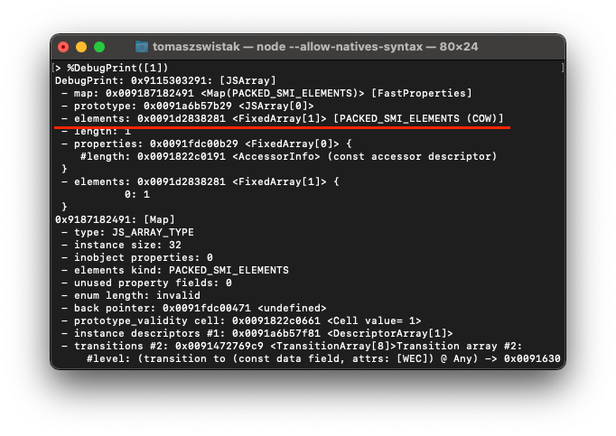
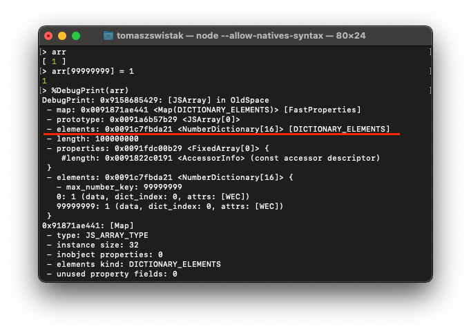
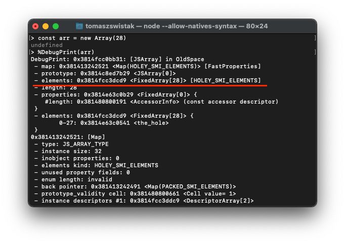

# Co powinieneś wiedzieć o Array w JavaScript?

(oryginalnie opublikowane na https://ohmydev.pl/post/co-powinienes-wiedziec-o-array-w-javascript-4mjn)

Hej! Dzisiaj opowiem nieco o Array w JavaScript. Jaka to jest struktura danych, jak działa i co warto wiedzieć? Zacznijmy!

## Czym są struktury danych?

Na początek trochę teorii. Struktura danych to sposób organizacji danych w pamięci komputera. Powinna ona być zaprojektowana tak, aby umożliwić wydajny dostęp i modyfikację zawartych w niej danych. Na pewno kojarzysz z teorii takie struktury danych jak grafy, drzewa czy listy. Dzisiaj, z racji skupienia się na JavaScriptowym `Array`, opowiemy sobie o listach.

## Cechy list

Najprostszymi strukturami danych są listy. Lista z definicji reprezentuje elementy, które:

- są policzalne,
- są uporządkowane,
- mogą się powtarzać.

W teorii algorytmiki możemy wyróżnić wiele struktur danych, które spełniają założenia list, m.in.: wektory (nieskończone tablice, listy tablicowe), listy wiązane, listy z przeskokami, zbiory bitowe. Założenia listy spełnia też tablica, przy czym ona częściej uznawana jest jedynie za złożony typ danych, niż strukturę danych. Jeśli jesteś ciekaw teorii na temat list, zapraszam do artykułu na moim blogu: https://swistak.codes/listy-najpopularniejsze-zlozone-typy-danych/.

## Array

Jakie mamy listy w JavaScript? Otóż język domyślnie oferuje nam tylko jedną strukturę spełniającą te założenia. Jak możesz się domyśleć, jest to `Array`, czyli tablica. Co warto zauważyć, tablica w JavaScript nie jest zwykłą tablicą, jaką znamy z innych języków programowania, tylko jest de facto wektorem (tablicą nieskończoną). Czym ona się wyróżnia? Po kolei:

- Pod spodem w pamięci komputera jest zwykłą tablicą, czyli elementy są zapisane na kolejnych komórkach pamięci.
- Nie ogranicza nas rozmiar tablicy. W razie potrzeby jest ona powiększana, czego nie znajdziemy w tradycyjnych tablicach znanych z innych języków programowania.

Tutaj trafiamy na najciekawszy element w JS, czyli powiększanie. W silniku V8 (Node, Chrome) pusty Array ma pod spodem 0-elementową tablicę. Po dodaniu pierwszego elementu za pomocą push(), dostajemy już pod spodem 17-elementową tablicę. Natomiast, jeśli zinicjalizowalibyśmy Array z jednym elementem, to pod spodem będzie 1-elementową tablicą. Wzór, jaki jest zastosowany w V8 na wyznaczenie nowego rozmiaru tablicy to: `new_capacity = old_capacity + old_capacity / 2 + 16`.

Możesz te rzeczy sprawdzić na własną rękę. Aby to zrobić, uruchom Node z parametrem `--allow-natives-syntax`. Udostępnia nam ona zestaw poleceń pozwalających podejrzeć, jak V8 wewnętrznie traktuje pewne rzeczy. Nas interesuje najbardziej `%DebugPrint(arg)`, która zwraca wewnętrzne szczegóły podanej mu w argumencie zmiennej. Nas interesuje właściwość elements. Zobacz poniższe zrzuty ekranu:

Swoją drogą, jak `Array` ma bardzo dużo elementów, albo duże luki, to V8 przestaje korzystać z tablic pod spodem, a zamiast tego z tablic haszowanych. O tym jednak nie dziś. Mimo to, zobacz zrzut ekranu udowadniający to:

Jeszcze inna rzecz, jaką warto wiedzieć, to fakt, że w JS wcale nie warto inicjalizować tablicy z określonym rozmiarem za pomocą `Array(n)`. V8 określa wówczas tablicę jako `HOLEY` i nawet jeśli wypełnimy ją elementami, to silnik porzuci ewentualne optymalizacje z tego powodu. Warto poczytać o tym tutaj: https://v8.dev/blog/elements-kinds. Dowód na zrzucie ekranu:

## Wydajność wektorów

W kwestii struktur danych warto wiedzieć jaką wydajnością się one charakteryzują. Co możemy powiedzieć o Array?

- Dostęp do danych po indeksie jest natychmiastowy — O(1).
- Dodawanie elementów na koniec jest natychmiastowe, jeżeli zostało jeszcze wolne miejsce w tablicy znajdującej się pod spodem — O(1).
- Dodawanie elementów w innych miejscach (lub na końcu, gdy brakuje już miejsca), wymaga przepisania całej tablicy lub części elementów w nowe miejsce — O(n).

Z racji braku dużego wyboru w JavaScript, `Array` jest dość uniwersalną strukturą. Jeśli potrzebujemy przechowywać wiele danych w postaci uporządkowanej i najczęściej będziemy się do nich odwoływać właśnie po indeksie, to powinien być Twój wybór.

Jeżeli jesteś ciekaw(a), jak dokładnie wygląda wydajność, zapraszam do mojego artykułu poświęconego listom tablicowym: https://swistak.codes/tablice-i-listy-tablicowe/. Opisuje on, jak działają one w C++, Javie i C#, ale mechanizm w JS jest analogiczny.
