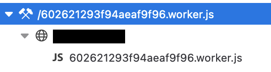

# Najprostszy sposób na korzystanie z web workerów

(oryginalnie opublikowane na https://ohmydev.pl/post/najprostszy-sposob-na-korzystanie-z-web-workerow-1l81)

Hej!

Ostatnio potrzebowałem w projekcie przenieść część ciężkich obliczeń na webworkery i pomyślałem, że podzielę się z Wami, jak można to szybko osiągnąć.

## Web workery

Jeżeli nie wiesz czym są web workery, to śpieszę z wyjaśnieniem. Jest to sposób na uruchomienie fragmentu kodu naszej aplikacji w oddzielnym wątku, działającym w tle. Jak zapewne wiesz, JS jest jednowątkowy i nawet jak używamy async/await/Promise, to i tak operujemy wciąż na jednym wątku. Dlatego powstały web workery, aby odciążyć wątek odpowiadający za UI aplikacji. Więcej info znajdziesz tutaj: https://developer.mozilla.org/en-US/docs/Web/API/Web_Workers_API/Using_web_workers. Zarazem możesz jednak zauważyć, że ich użycie opisane tutaj wydaje się być dość skomplikowane, a gdy jeszcze nasz kod jest bundlowany, to problemy tylko się piętrzą.

## Comlink

Rozwiązaniem tych problemów jest wspaniała paczka wypuszczona przez Google o nazwie [Comlink](https://github.com/GoogleChromeLabs/comlink). Dzięki niej nie musimy pisać całego kodu odpowiadającego za komunikację, bo Comlink wszystko upraszcza do dobrze nam znanych funkcji asynchronicznych, które pod spodem tak naprawdę działają w web workerze. Jednak to wciąż nie jest to, co chciałem pokazać. W przypadku Comlinka wciąż mamy etap konfiguracyjny. Jak nie bundlujemy aplikacji to wszystko jest proste, ale jednak zwykle mamy w projektach Webpacka i musimy wziąć go pod uwagę. Dlatego...

## Comlink-loader

Dlatego chciałem pokazać [Comlink Loader](https://github.com/GoogleChromeLabs/comlink-loader). Jest to loader do Webpacka, który robi za nas wszystko to, co musielibyśmy ręcznie definiować w Comlink. Cała konfiguracja sprowadza się do dodania do Webpacka następującej reguły w configu:

```javascript
  module: {
    rules: [
      {
        test: /\.worker\.(js|ts)$/i,
        use: [{
          loader: 'comlink-loader',
          options: {
            singleton: true
          }
        }]
      }
    ]
  }
```

Następnie kod, który chcemy wydzielić do web workera zamieniamy na funkcję asynchroniczną i zmieniamy nazwę pliku, aby przed rozszerzeniem było .worker, np. myFunction.worker.ts.

Comlink loader zadba nam o to, aby kod zamieszczony w pliku .worker był uruchamiany przez web worker i także o lazy loading tych modułów. Tylko tyle wystarczy, aby korzystać w projekcie z web workerów :-) .

## Problemy z Webpack 5

Od razu wspomnę, że przy produkcyjnych buildach z Webpack 5 możecie mieć problemy. Niestety, optymalizacje Webpacka 5 są nieco zbyt agresywne i pozbywają się webworkerów obsługiwanych przez comlink-loader. W tym celu, trzeba dodać do configa jeszcze następującą linijkę:

```javascript
optimization: {
    usedExports: false
}
```

Wtedy wszystko będzie działać poprawnie. Możliwe, że jeśli czytasz ten wpis w przyszłości, to już nie trzeba tego robić. Odsyłam dlatego do issue na GitHubie, gdzie jest opisany ten problem: https://github.com/GoogleChromeLabs/comlink-loader/issues/34.

## Skąd wiedzieć, czy mój kod działa w Web Workerze?

Najprościej można to sprawdzić w dev toolsach na zakładce Debugger. Kod uruchamiany przez web workery powinien być specjalnie oznaczony. Na przykład w Firefox wygląda to tak:



Dwa młotki obok nazwy pliku wskazują, że jest to Web Worker.