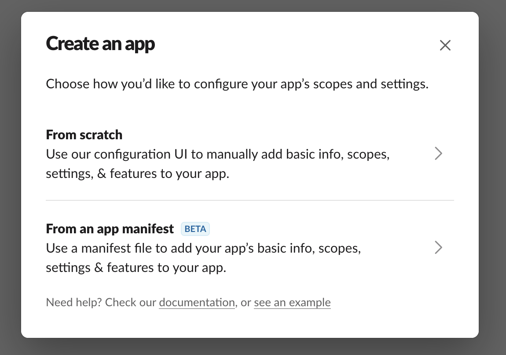
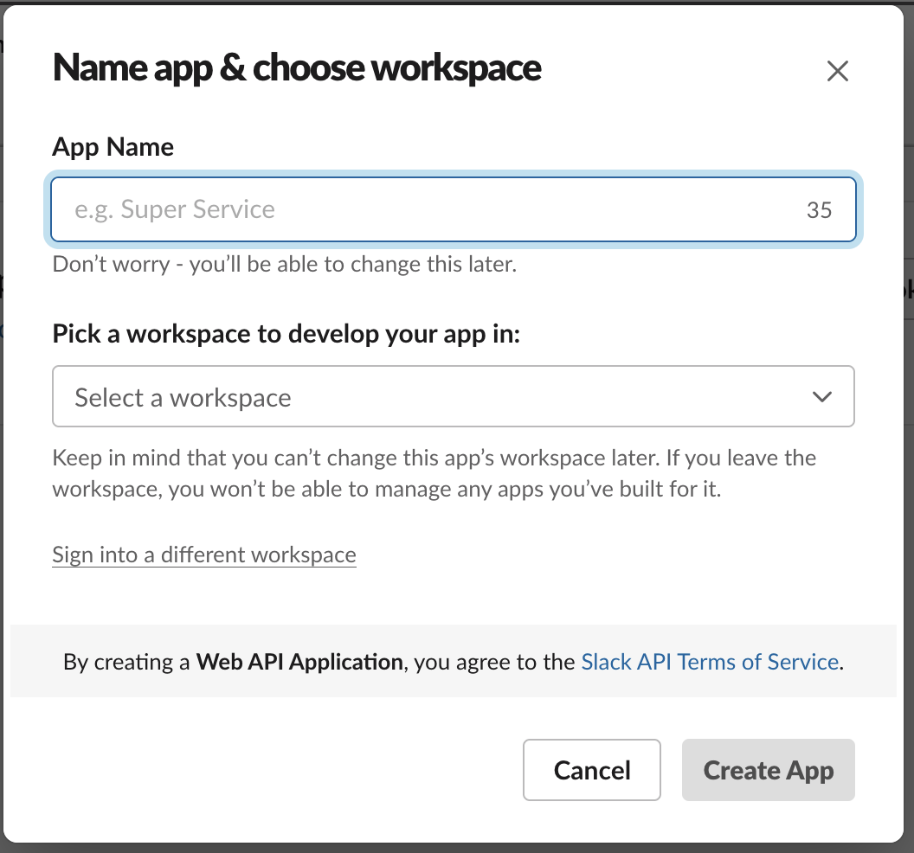
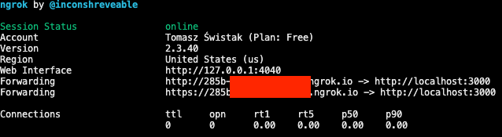
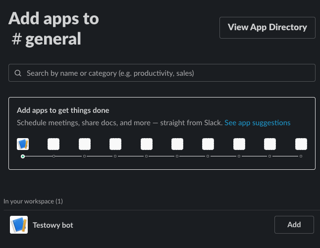
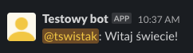
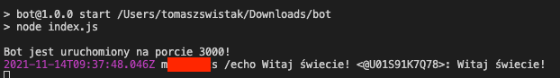

# Piszemy bota do Slacka w JS

(oryginalnie opublikowane na https://ohmydev.pl/post/piszemy-bota-do-slacka-w-js-6ko)

Ostatnio miałem okazję robić bota do Slacka i pomyślałem, że pokażę Wam, jak łatwo można takowego zrobić w JavaScript. Zobaczycie tutaj jak zrobić bardzo prosty skrypt — bot odpowiadający na komendę.

## Przygotowanie aplikacji na Slacku

Zanim zaczniemy tworzyć bota, musimy wykonać kilka kroków przygotowawczych.

Pierwszym z nich jest założenie własnego workspace na Slacku, który posłuży naszym testom. Jest to darmowe i można to zrobić na stronie https://slack.com/ po kliknięciu Try for free. Przy okazji też, założymy konto, co będzie nam potrzebne w dalszym kroku.

Jak już mamy konto i workspace, zarejestrujmy aplikację. W tym celu udajemy się na stronę https://api.slack.com/apps?new_app=1 i w oknie Create an app wybieramy opcję From scratch.



W następnym oknie będziemy spytani o nazwę aplikacji (można zmienić) i workspace, na którym będziemy ją developować. Co istotne, workspace nie da się zmienić, więc jak będziesz chciał wrzucić aplikację na prawdziwy, to zostaje albo opublikować aplikację w Marketplace (więc stanie się publiczna), albo powtórzyć ten krok. Po uzupełnieniu danych naciskamy Create App.



W tym momencie mamy już zarejestrowaną aplikację Slackową, jednak musimy ją jeszcze skonfigurować. Przejdź do zakładki OAuth & Permissions i znajdź w niej Scopes. Tutaj konfigurujemy, jakie uprawnienia ma posiadać nasz bot. Jeżeli ma to być jedynie bot odpowiadający na komendy, wystarczy, że do Bot Token Scopes dodamy uprawnienia commands (reagowanie na komendy) oraz chat:write (pisanie na kanałach).

Po wykonaniu tego wybieramy na samej górze Install to Workspace. Zostaniemy wtedy zapytani o nadanie uprawnień, na co się zgadzamy i aplikacja powinna wylądować już na naszym Slacku. Oczywiście, jeszcze nic nie będzie robić, ale do tego już przejdziemy.

## Aplikacja w Node.JS

### Start projektu

Jak wspomniałem na starcie, naszego bota napiszemy w JavaScript. Będzie to aplikacja serwerowa, więc trzeba mieć wgranego Node.JS (najlepiej w wersji LTS). Załóż folder, w którym będziesz trzymać kod i wystartuj projekt poleceniem

```bash
npm init -y
```

Następnie, dodajmy od razu paczkę [Bolt](https://api.slack.com/tools/bolt), która służy do zakładania serwerów służących jako boty Slackowe. Jeżeli nie lubisz JS, dostępne są też wersje dla Pythona i Javy, ale nie będę poświęcał im tutaj miejsca.

```bash
npm install @slack/bolt
```

### Podstawowy kod serwera

Teraz możemy przejść do pisania kodu. Załóż plik index.js i wpisz w nim następujący kod:

```javascript
const { App } = require("@slack/bolt");

const app = new App({
  token: '',
  signingSecret: ''
});

(async () => {
  const port = 3000;
  await app.start(process.env.PORT || port);
  console.log(`Bot jest uruchomiony na porcie ${port}!`);
})();
```

Na początku zaciągamy z paczki Bolt klasę App, która służy do stworzenia nowej instancji serwera. Następnie tworzymy instancję, na razie bez uzupełnionych danych dostępowych. Dalej mamy IIFE startujące serwer na porcie zapisanym w zmiennej środowiskowej PORT, a jeśli takiej nie ma, to na typowym dla Node 3000.

### Obsługa sekretów

Oczywiście moglibyśmy wkleić wprost token i signingSecret w pokazane wyżej stringi, ale jak się uczyć to na solidnie. Nie hardkodujemy sekretów, nigdy. Powinny być one zaciągane z zewnętrznego źródła, które nie jest commitowane na GITa, np. w zmiennych środowiskowych systemu. A takie najprościej dla projektów ustawiać za pomocą plików .env.

Utwórz w takim razie plik .env, a w jego zawartości daj:

```bash
SLACK_TOKEN="[tutaj token]"
SLACK_SECRET="[tutaj signing secret]"
```

Wartości sekretów możesz wziąć ze strony https://api.slack.com/apps po wejściu w założoną przez Ciebie aplikację. Token to Bot User OAuth Token, który znajdziesz w zakładce OAuth & Permissions. Signing secret znajdziesz natomiast w Basic Information. Wartości po prostu wklej w cudzysłowia. Przy okazji pamiętaj, aby dodać plik .env do gitignore (zwykle gotowe konfiguracje robią to z góry).

Oczywiście, plik .env to tylko plik, który w żaden sposób nie wpływa sam z siebie na system. Musimy go jeszcze przeparsować. Do tego służy biblioteka dotenv, która zrobi to wszystko za nas i wstawi wartości zmiennych do standardowego miejsca, gdzie w JS szukamy zmiennych środowiskowych — do obiektu process.env.

```bash
npm install dotenv
```
Teraz tylko skonfigurujmy, aby aplikacja uruchomiła dotenva, a potem skorzystała z wartości zapisanych w .env:

```javascript
require("dotenv").config();

const app = new App({
  token: process.env.SLACK_TOKEN,
  signingSecret: process.env.SLACK_SECRET,
});
```

### Dodanie obsługi polecenia

Obiekt app ma kilka metod, które pozwalają mu na interakcję ze Slackiem. Ich spis znajdziesz w [dokumentacji Bolta](https://slack.dev/bolt-js/reference). Od razu powiem, że do obsługi polecenia nas interesuje `app.command()`. Zakładając, że nasza komenda będzie nazywać się /echo, funkcję tą użyjemy następująco:

```javascript
app.command("/echo", async ({ command, ack, say }) => {
  try {
    await ack();
    say();
  } catch (error) {
    console.error(error);
  }
});
```

Teraz, powiedzmy sobie, co tu się dzieje. Pierwszy argument to komenda, na jaką mamy reagować, a drugi to callback opisujący zachowanie. Callback otrzymuje obiekt z wieloma argumentami, gdzie nas interesują trzy:

- command — opisujący parametry wywołanego polecenia. Niestety dokumentacja kompletnie nie opisuje jego zawartości (każą sobie debugować albo skorzystać z typów TypeScript ¯\(ツ)/¯ ).
- ack — funkcja, którą odpowiadamy serwerowi, że otrzymaliśmy polecenie. Skojarzenie z handshake w TCP jest tu jak najbardziej prawidłowe.
- say — funkcja pozwalająca wysłać nam odpowiedź na kanał.

Tak naprawdę, po otrzymaniu polecenia pierwsze co powinniśmy zrobić to wywołanie ack, a dopiero potem piszemy logikę.

### Logika polecenia

Teraz zaprogramujmy logikę. Na potrzeby tego tutoriala założyłem, że po wywołaniu komendy z jakimś tekstem, bot odpowie mentionując autora tym samym tekstem. Czyli dajmy na to, komunikacja wyglądałaby następująco:

```
[user] /echo foo
[bot] @user: foo
```

Tutaj przyda nam się wiedza o tym, kto wysłał polecenie, oraz jaka była jego treść. Znajdziemy to w obiekcie command. Interesujące nas pola to:

- user_id — identyfikator użytkownika wysyłającego polecenie. Mentiony z poziomu API robimy po identyfikatorze, nie po nazwie.
- user_name — nazwa użytkownika; przydatne do debugowania.
- command — wywołane polecenie.
- text — treść polecenia.

Aby kogoś zmentionować stosuje się zapis `<@USER_ID>`. W takim razie nasza wiadomość będzie wyglądać następująco:

```javascript
const message = `<@${command.user_id}>: ${command.text}`;
```

Oczywiście wyślijmy ją na kanał oraz przy okazji zalogujmy do konsoli, co się stało. Pełen kod komendy będzie wyglądać wówczas następująco:

```javascript
app.command("/echo", async ({ command, ack, say }) => {
  try {
    await ack();
    const message = `<@${command.user_id}>: ${command.text}`;
    console.log(
      new Date(),
      command.user_name,
      command.command,
      command.text,
      message
    );
    say(message);
  } catch (error) {
    console.error(error);
  }
});
```

Tak oto napisaliśmy naszego własnego Slack bota :) . Ale to nie wszystko, musimy go jeszcze uruchomić.

### Ostateczne przygotowanie projektu Node do uruchomienia

Ostatni krok po stronie JS, jaki nam został to skonfigurowanie skryptu uruchamiającego aplikację. Robimy to w pliku package.json w scripts. Powinien być tam odgórnie zdefiniowany pusty skrypt do testów. My go nie potrzebujemy i zastąpmy go standardowym start, który odpali nasz index.js:

```json
 "scripts": {
   "start": "node index.js"
 },
```

Możesz teraz uruchomić bota poleceniem

```bash
npm start
```

## Podpięcie bota do Slacka

Oczywiście to nie koniec pracy. Nie podepniemy się do Slacka korzystając z localhost. Jednak, póki nie chcemy wystawiać bota na żaden serwer zewnętrzny, chcielibyśmy go przetestować z lokalnej maszyny. Jeżeli masz zewnętrzny adres IP, to nie ma żadnego problemu i sporą część tego co tu napiszę, możesz pominąć. Zakładam jednak, że takiego możesz nie mieć i wówczas warto skorzystać z darmowej usługi tunelowania Ngrok.

### Konfiguracja Ngrok

Ngrok pozwala nam wystawić dowolny port z naszego komputera, schowanego za wewnętrznym IP, pod losowo dobraną domeną. Wymagane jest założenie konta na https://ngrok.com/. Po jego założeniu będziesz poprowadzony przez proces konfiguracji, z którego wykonaj pierwsze punkty. Gdy będziesz mieć punkt o uruchomieniu tunelowania http z portu 80, zmień komendę na

```bash
ngrok http 3000
```

Dzięki temu stunelujemy sobie port 3000 wystawiony przez naszego bota. Powinieneś otrzymać w konsoli wówczas coś takiego:



Spisz sobie adres widoczny w Forwarding, przyda się! Właśnie pod nim jest dostępny w tym momencie Twój bot dla zewnętrznego świata.

### Utworzenie komendy w aplikacji

Teraz wroćmy do https://api.slack.com/apps i ponownie wejdź do swojej aplikacji. Tym razem, z menu po lewej wybierz Slash Commands i tam Create new Command. Powinieneś otrzymać okienko, w którym należy uzupełnić informacje na temat polecenia:

- Command — wpisujemy takie samo polecenie jak w skrypcie JS.
- Request URL — podajemy adres w formie: `http://[twój adres]/slack/events`. Jak korzystasz z ngroka, to pod [twój adres] wpisz adres z Ngroka. Jeśli masz zewnętrzne ip, to podaj tam swoje ip i po dwukropku 3000.
- Short description — krótki opis co polecenie wykonuje
- Usage Hint — tam podajemy przykładowe użycie polecenia.

Po uzupełnieniu naciśnij Save.

W tym momencie wszystko jest już skonfigurowane.

## Przetestujmy!

Następne kroki wykonasz już na workspace Slackowym, do którego przypisałeś bota. Najpierw musimy dodać bota na jakiś kanał. Wejdź na któryś, np. general i w prawym górnym rogu masz liczbę członków. Kliknij i będziesz mieć opcję dodania aplikacji na kanał. Wejdź w nią i wyszukaj bota, którego właśnie stworzyłeś.



Jak bot jest już członkiem kanału, to nie zostaje nam nic innego jak przetestować. Wpisz

```
/echo Witaj świecie!
```

i jeśli wszystko działa dobrze, powinieneś otrzymać odpowiedź:



Warto też zajrzeć do terminala, gdzie mamy odpalony serwer i zobaczyć, jak wygląda nasze logowanie informacji:



I to by było na tyle. Jak mogłeś zobaczyć, pisanie botów na Slacka jest bardzo proste i z odrobiną fantazji możesz w ten sposób zrobić bardzo przydatne narzędzia. Pamiętaj tylko, że jeśli chcesz korzystać z bota "produkcyjnie", to warto zakupić jakiegoś VPSa i na nim uruchomić skrypt.

Jeśli zgubiłeś się w artykule, albo chcesz zobaczyć gotowe rozwiązanie, znajdziesz je na moim GitHubie: https://github.com/tswistak/simple-slack-bot
