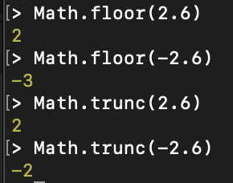
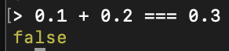
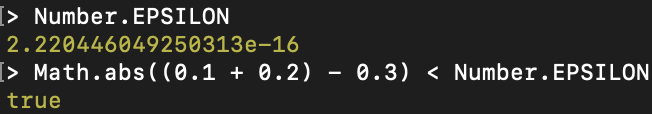
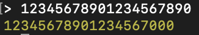
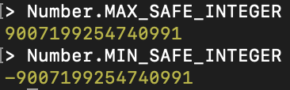
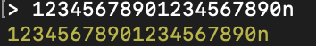

# Popularne matematyczne błędy w JS (i nie tylko)

(oryginalnie opublikowane na https://ohmydev.pl/post/popularne-matematyczne-bledy-w-js-i-nie-tylko-45m8)

[Po poprzednim wpisie, gdzie omawiałem bardzo ogólne błędy popełniane w projektach JavaScriptowych](../top-5-najczestszych-bledow-w-projektach-jsowych/article.md), chciałem teraz przejść do kilku zagadnień związanych z obsługą obliczeń matematycznych w JS. Jako że pracując przy wizualizacjach danych mam dość często do czynienia z matematyką, to pomyślałem, że podzielę się swoimi różnymi spostrzeżeniami.

Ponownie, spostrzeżenia te to nie tylko frontend i można je zastosować też w innych językach programowania.

## Zaokrąglanie

Zaokrąglanie powinno wydawać się oczywistą rzeczą, ale nie zawsze dobrze są rozumiane funkcje służące jemu. Najpowszechniej spotykanym błędem jest twierdzenie, że `Math.floor()` służy obcięciu wartości dziesiętnej. Tak nie jest. Zobaczmy, jakie mamy funkcje i do czego służą:

- `Math.round()` — jest to klasyczne zaokrąglanie: w dół, jeżeli część dziesiętna jest mniejsza od 0,5; w górę, jeśli większa; dla 0,5 zaokrągla się w kierunku bliższym do plus nieskończoności. Kierunek zaokrągleń jest wyznaczany przez wartość absolutną, więc wartości ujemne nie mają tu znaczenia.
- `Math.ceil()` — zaokrąglenie w górę
- `Math.floor()` — zaokrąglenie w dół
- `Math.trunc()` — obcięcie części dziesiętnej

O ile dwóch pierwszych tłumaczyć nie trzeba, o tyle floor i trunc są często mylone ze sobą. Zobaczcie sami różnicę w wynikach:



Po prostu `floor` to zaokrąglenie w dół. W przypadku liczb ujemnych zaokrąglenie w dół przestaje tylko obcinać część dziesiętną, a faktycznie zmniejsza liczbę o 1 (czyli -2,6 staje się -3). Dla liczb ujemnych wrażenie odcięcia części dziesiętnej da `ceil`. Jednak, zamiast tak kombinować, po prostu używajmy mniej popularne `trunc`.

## Błędy zaokrągleń przy obliczeniach

Często zadawanym pytaniem przez początkujących jest, dlaczego obsługa liczb dziesiętnych wygląda dziwnie. Pokazywanym wówczas przykładem jest to:



Nie jest to błąd JavaScriptu, tylko kwestia tego, jak liczby rzeczywiste są zapisywane w pamięci. Mianowicie podlegają one standardowi IEEE 754 i są zapisywane jako liczba zmiennoprzecinkowa na 64-bitach. Bardziej szczegółowo, 52 bity są poświęcone na mantysę, 11 bitów na wykładnik i 1 na znak. Tylko co to znaczy?

Zapis w tym standardzie wygląda mniej więcej tak: mantysa * 2^(wykładnik). Oznacza to, że jesteśmy skazani na zaokrąglenia, wynikające z mnożenia przez potęgę i nie obejdziemy tego w JS. Możesz zresztą taki zapis znać ze szkoły jako notacja naukowa, tylko tam nie było podnoszone do potęgi 2 tylko 10.

Możemy natomiast robić porównania z marginesem błędu. JS nawet posiada odgórnie zdefiniowany taki margines, dzięki któremu możemy robić porównania: `Number.EPSILON`. Jak to wygląda w praktyce?



W powyższym zapisie e-16 oznacza mnożenie przez 10^(-16).

Więcej na temat tego, jak liczby rzeczywiste są zapisywane w pamięci, znajdziesz tutaj: https://swistak.codes/liczby-wymierne-i-rzeczywiste-w-zero-jedynkowym-swiecie/

## Ograniczenia liczb całkowitych

Jak już zauważyliśmy w poprzednim punkcie, JavaScript traktuje wszystko jako liczby zmiennoprzecinkowe. Oznacza to, że nie mamy tutaj tradycyjnych int, long, byte itp. typów całkowitych. Pomijając kwestie wydajnościowe (obliczenia zmiennoprzecinkowe są bardziej wymagające), ma to też inną, mniej zauważalną z początku wadę — liczby zmiennoprzecinkowe nie mają ograniczeń zakresu.

Tylko dlaczego to jest wada? Ponieważ, jak już wcześniej wspomniałem, liczby zmiennoprzecinkowe operują na zaokrągleniach. W pewnym momencie nawet w przypadku liczb całkowitych zaczniemy tracić precyzję i liczby będą zaokrąglone. Pierwszy z brzegu przykład:



Jak możemy temu zapobiec? Są dwa rozwiązania:

- Możemy pilnować się, żeby liczby, które używamy, nie przekraczały bezpiecznego zakresu. Wewnątrz niego nie występują zaokrąglenia dla liczb całkowitych. Jest on wyznaczony przez dwie stałe:



- Możemy stosować obiekt typu BigInt: https://developer.mozilla.org/en-US/docs/Web/JavaScript/Reference/Global_Objects/BigInt. W skrótowym zapisie wystarczy na końcu liczby dopisać literkę `n`:



Jednak warto wiedzieć, że stosowanie BigInt nie jest lekiem na całe zło. Wsparcie dużych liczb całkowitych (w zasadzie nieskończenie dużych) jest zrobione programowo i nie jest wspierane przez hardware (w przeciwieństwie do obliczeń zmiennoprzecinkowych). Oznacza to, że BigInt są wolniejsze od zwykłych Numberów. Jeżeli masz pewność, że nie przekroczysz bezpiecznego zakresu (z mojego doświadczenia zdecydowana większość przypadków), nie używaj BigInt.

## Reszta z dzielenia nie jest zgodna z definicją matematyczną

Ostatni temat jest związany z tym, że nie można do końca ufać operacji reszty z dzielenia. Dlaczego? Ponieważ jest ona nie do końca zgodna z matematyczną definicją. Tym samym, jeśli przenosimy wzory matematyczne, trzeba bardzo na to uważać.

Problem jest, dokładnie mówiąc, związany z obsługą liczb ujemnych. W JS: -2 % 5 = -2, podczas gdy zgodnie z teorią matematyki powinno to być 3. Jest to dość powszechny problem, nie tylko dotyczący JSa i więcej piszę o nim tutaj: https://swistak.codes/dziwny-przypadek-reszty-z-dzielenia/.

Jeżeli nie chcesz wnikać w teorię, to tutaj znajdziesz algorytm obliczający resztę z dzielenia zgodnie z matematyczną definicją:

```javascript
function mod(a, b) {
  let r = a % b;
  if (r < 0) {
    if (b > 0) {
      r = r + b;
    } else {
      r = r - b;
    }
  }
  return r;
}
```

Liczę, że te kilka punktów rozwiewa Twoje ewentualne wątpliwości w kwestiach różnych zachowań liczb w JavaScript.

Jeśli interesują Cię takie tematy, gdzie teorię programowania przekuwamy w praktykę, zachęcam do śledzenia mojego bloga, gdzie staram się omawiać różne teoretyczne zagadnienia prostym językiem i przekładam je w praktyczne zastosowania: https://swistak.codes/
